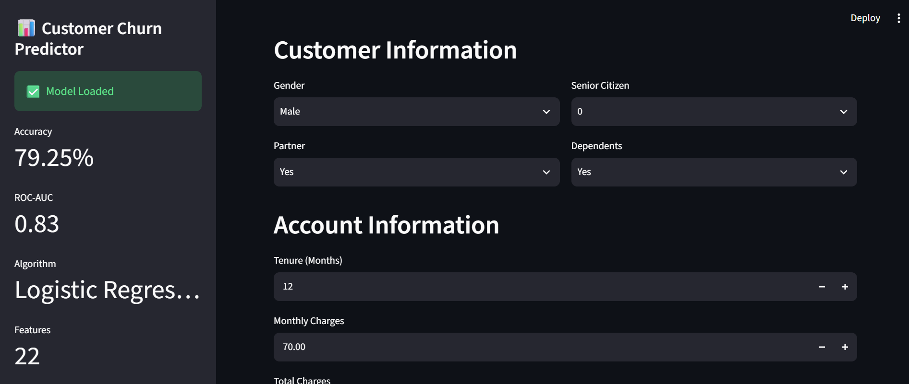
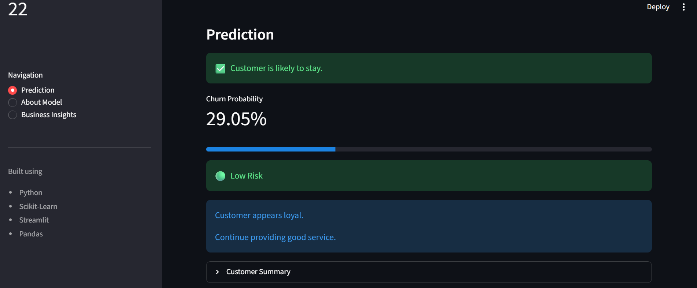

# End-to-End-Customer-Churn-ML-Pipeline

## Project Overview
An end-to-end Machine Learning project for customer churn prediction featuring data analysis, feature engineering, explainable AI, Streamlit deployment, SQL, and Power BI.

## Dataset

- Dataset Used: IBM Telco Customer Churn Dataset

- Target Variable: Churn (Yes / No)

- Number of Customers: 7043

- Features:
    - 19 original features
    - 3 engineered features

## Technologies Used

```
Python
Pandas
NumPy
Matplotlib
Scikit-learn
Streamlit
Joblib
Git
GitHub
Power BI 
```

## Project Structure

```text
End-to-End-Customer-Churn-ML-Pipeline/

app/
    streamlit_app.py
    views/

data/

models/

src/

outputs/

notebooks/

requirements.txt

README.md
```

## Models Evaluated

| Model | Precision | Recall | F1 | ROC-AUC |
|------|------:|------:|------:|------:|
| Logistic Regression | 0.63 | 0.52 | 0.57 | 0.835 |
| Decision Tree | 0.48 | 0.50 | 0.49 | 0.653 |
| Random Forest | 0.60 | 0.48 | 0.54 | 0.815 |

## Streamlit Application

The project includes an interactive Streamlit application where users can:

- Enter customer information
- Predict churn
- View churn probability
- See business recommendations



---


---



## Installation

Clone the repository

```bash
git clone https://github.com/riyarvv/End-to-End-Customer-Churn-ML-Pipeline.git
```

Move into the project

```bash
cd End-to-End-Customer-Churn-ML-Pipeline
```

Create virtual environment

```bash
python -m venv .venv
```

Activate it

Windows:

```bash
.venv\Scripts\activate
```

Install dependencies

```bash
pip install -r requirements.txt
```

Run the app

```bash
streamlit run app/streamlit_app.py
```

## Google Colab Timeline
Day 1 completed 
- Created github and google drive folder structure
- Loaded dataset as dataFrame
- Used head(), shape, columns, and info()

Day 2 completed
- Understood the dataset
- Gathered info for documentation in docs folder using value_counts()

Day 3 completed  
- Performed EDA
- Plotted countplots for various columns in dataFrame

Day 4 completed
- Plotted countplots for service and billing columns

Day 5 completed
- Plotted histogram, KDE, and boxplot
- Learnt about outliers

Day 6 completed
- Bivariate analysis
- Crosstab, countplot, and boxplot

Day 7 completed
- Analyxed correlation heatmap
- Completed EDA analysis

Day 8 completed
- Handled missing values
- Cleaned and saved the processed dataset

Day 9 completed
- Created src folder in drive and added .py files
- Created new columns after feature engineering

Day 10 completed
- Split data into train and test
- Prevented data leakage

Day 11 completed
- Preprocessing with encoding and scaling

Day 12 completed
- Trained dataset on 3 basic models
- Saved reusable pipelines

Day 13 completed
- Evaluated models on accuracy, precision, recall, f1, and roc

Day 14 completed
- Refactor project structure
- Create reusable utility modules

Day 15 completed
- Hyperparameter tuning
- Comparison of accuracy

Day 16 completed
- Model explainability
- Identified features had greater impact on churn


